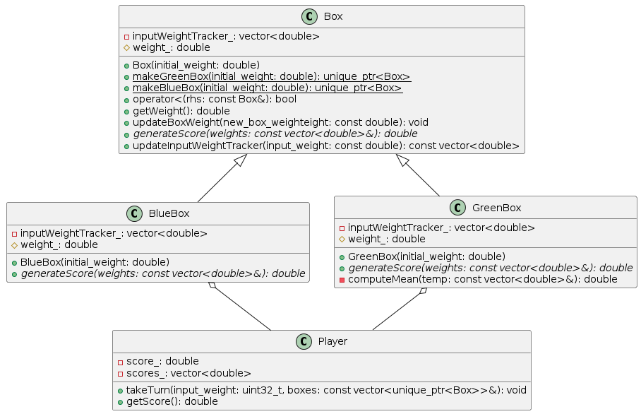

# Project Name: asaphus_challenge

Author - Ayush Kumar


# Prerequisites:
Before compiling and running the project, please ensure that you have installed the following:

- CMake (version >=3.25.0)
- MinGW-w64 Toolchain or other C++ Compiler (eg., GCC, Clang, etc)

# How to build the project

1. Create a build directory.

    ````bash
        mkdir build
        cd build
    ````
2. Run CMake to generate the build files using MinGW

    ````bash
        cmake -S /path/to/source/with/CMakeLists.txt -G "MinGW Makefiles"
        example: cmake -S ..\asaphus_challenge -G "MinGW Makefiles"
    ````
3. Compile and build the project.

    ````bash
        cmake --build /path/to/build/files
        example: cmake --build ../build
    ````

# Run Instructions

After succesfully compiling the project, you can run the executable file as follows.

1. Navigate to the folder where executable is present. (The executable file can be found in the './challenge' folder):

    ````bash
        cd challenge
    ````
2. Run the executable:

    ````bash
        .\AsaphusChallenge.exe
    ````
# Additional Notes

Using CMake extension on Visual Studio code makes it easier to compile and run the User Interface.

# Architectural Notes 

- The input weights represents a physical quantity and therefore will be greater than or equal to 0. 
- If there is a single weight in the input, only player A will get to play and the player B doesnot get to play (the score of player B will be considered 0).
- The player is independent of the boxes used to play the game.
- The game can be extended to play with more green and blue boxes.
- Each box maintains a vector which stores the weights it has observed before, providing flexibility to generate scores using previous weights if the generate score requirement changes.
- The player scores are also stored for each turn, which can tell the progress of the game at each stage.

# UML Class Diagram




